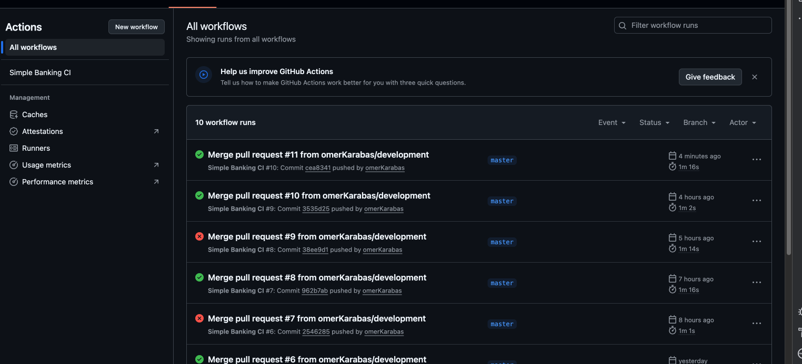

# Simple Banking API

## Architecture

### Technology Stack
- **Framework**: Spring Boot 3.2.0
- **Java Version**: 17
- **Database**: PostgreSQL 13
- **ORM**: Spring Data JPA + Hibernate
- **API Documentation**: OpenAPI 3 (Swagger)
- **Build Tool**: Maven
- **Containerization**: Docker & Docker Compose
- **Validation**: Bean Validation
- **Caching**: Spring Cache
- **Logging**: SLF4J + Logback

### Project Structure
```
src/main/java/com/eteration/simplebanking/
├── config/                    # Configuration classes
│   ├── CacheConfig.java      # Cache configuration
│   ├── LocaleConfig.java     # Internationalization configuration
│   ├── OpenApiConfig.java    # Swagger/OpenAPI configuration
│   └── security/             # Security configuration
│       ├── SecurityConfiguration.java
│       └── SecurityProperties.java
├── controller/                # REST API Controllers
│   ├── advice/
│   │   └── GlobalExceptionHandler.java
│   └── BankAccountController.java
├── domain/                    # Domain layer
│   ├── constant/
│   │   ├── CacheConstants.java
│   │   ├── LogConstants.java
│   │   └── ValidationRegex.java
│   ├── entity/               # JPA Entities
│   │   ├── BankAccount.java
│   │   ├── BaseEntity.java
│   │   └── transaction/      # Transaction types
│   │       ├── Transaction.java
│   │       ├── DepositTransaction.java
│   │       ├── WithdrawalTransaction.java
│   │       ├── PhoneBillPaymentTransaction.java
│   │       └── CheckTransaction.java
│   ├── enums/
│   │   ├── PhoneCompany.java
│   │   └── TransactionType.java
│   ├── repository/           # Data Access Layer
│   │   ├── BankAccountRepository.java
│   │   └── TransactionRepository.java
│   └── validation/           # Custom validation
│       ├── annotation/
│       │   ├── AccountNumber.java
│       │   ├── PhoneNumber.java
│       │   └── PositiveAmount.java
│       └── validator/
│           ├── AccountNumberValidator.java
│           ├── PhoneNumberValidator.java
│           └── PositiveAmountValidator.java
├── exception/                 # Exception handling
│   ├── AccountNotFoundException.java
│   ├── InsufficientBalanceException.java
│   ├── InvalidTransactionException.java
│   ├── StrategyNotFoundException.java
│   ├── TransactionValidationException.java
│   └── cosntant/
│       └── MessageKeys.java
├── model/                     # DTOs and mappers
│   ├── dto/
│   │   ├── request/
│   │   │   ├── BankAccountRequest.java
│   │   │   ├── CheckPaymentRequest.java
│   │   │   ├── CreateAccountRequest.java
│   │   │   ├── PhoneBillPaymentRequest.java
│   │   │   └── TransactionRequest.java
│   │   ├── response/
│   │   │   ├── BankAccountResponse.java
│   │   │   ├── ErrorResponse.java
│   │   │   ├── TransactionResponse.java
│   │   │   └── TransactionStatusResponse.java
│   │   └── SecurityConfig.java
│   └── mapper/
│       └── BankAccountMapper.java
├── service/                   # Business Logic Layer
│   ├── core/                 # Service implementations
│   │   ├── BankAccountServiceImpl.java
│   │   ├── BankingFacadeServiceImpl.java
│   │   └── TransactionServiceImpl.java
│   ├── interfaces/           # Service interfaces
│   │   ├── BankAccountService.java
│   │   ├── BankingFacadeService.java
│   │   └── TransactionService.java
│   └── strategy/             # Strategy Pattern implementation
│       ├── strategy/
│       │   ├── CheckPaymentTransactionStrategy.java
│       │   ├── DepositTransactionStrategy.java
│       │   ├── PhoneBillPaymentTransactionStrategy.java
│       │   └── WithdrawalTransactionStrategy.java
│       ├── TransactionStrategy.java
│       └── TransactionStrategyFactory.java
└── util/                      # Utility classes
    ├── SecureMaskUtil.java
    └── StringUtil.java
```


## Installation and Setup

### Requirements
- Java 17+
- Maven 3.6+
- Docker & Docker Compose
- PostgreSQL 13+

### Quick Start

#### 1. Clone the Project
```bash
git clone https://github.com/omerKarabas/simplebanking.git
cd simplebanking2
```

#### 2. Set Environment Variables
```bash
# Copy the development environment file
cp env.development .env
```

#### 3. Start Database with Docker
```bash
docker-compose -f docker-compose-development.yml up -d
```

#### 4. Run the Application
```bash
# With Maven
./mvnw spring-boot:run

# Or run DemoApplication.java from your IDE
```

#### 5. Test the API
- **Swagger UI**: http://localhost:8080/swagger-ui.html
- **API Docs**: http://localhost:8080/api-docs

## API Endpoints

### Bank Account Management

#### Create Account
```http
POST /api/v1/bank-account/create
Content-Type: application/json

{
  "owner": "John Doe",
  "accountNumber": "1234567890"
}
```

#### Deposit Money
```http
POST /api/v1/bank-account/credit/{accountNumber}
Content-Type: application/json

{
  "amount": 1000.00
}
```

#### Withdraw Money
```http
POST /api/v1/bank-account/debit/{accountNumber}
Content-Type: application/json

{
  "amount": 500.00
}
```

#### Phone Bill Payment
```http
POST /api/v1/bank-account/phone-bill-payment/{accountNumber}
Content-Type: application/json

{
  "phoneCompany": "COMPANY_A",
  "phoneNumber": "5551234567",
  "amount": 150.00
}
```

#### Check Payment
```http
POST /api/v1/bank-account/check-payment/{accountNumber}
Content-Type: application/json

{
  "payee": "ABC Company",
  "amount": 750.00
}
```

#### Query Account
```http
GET /api/v1/bank-account/{accountNumber}
```

## Database Structure and Entities

This project uses JPA (Java Persistence API) to design the database structure. Inheritance and relationships between entities are used to create a flexible and extensible structure.

### Entity Hierarchy

#### 1. BaseEntity (Base Entity)
Base class containing common fields for all entities:

```java
@MappedSuperclass
@EntityListeners(AuditingEntityListener.class)
public abstract class BaseEntity {
    
    @Id
    @GeneratedValue(strategy = GenerationType.IDENTITY)
    private Long id;
    
    @CreatedDate
    @Column(name = "created_at", nullable = false, updatable = false)
    private LocalDateTime createdAt;
    
    @LastModifiedDate
    @Column(name = "updated_at")
    private LocalDateTime updatedAt;
    
    @Version
    @Column(name = "version")
    private Long version;
}
```

#### 2. BankAccount Entity
Main entity representing bank accounts:

```java
@Entity
@Table(name = "bank_accounts", indexes = {
    @Index(name = "idx_account_number", columnList = "account_number")
})
public class BankAccount extends BaseEntity {

    @NotNull(message = "{validation.owner.required}")
    @Column(name = "owner", nullable = false)
    private String owner;

    @NotNull(message = "{validation.account.number.required}")
    @Column(name = "account_number", nullable = false, unique = true)
    private String accountNumber;

    @NotNull(message = "{validation.balance.required}")
    @Column(name = "balance", nullable = false)
    @Builder.Default
    private double balance = 0.0;

    @OneToMany(mappedBy = "account", cascade = CascadeType.ALL, fetch = FetchType.LAZY)
    @Builder.Default
    private List<Transaction> transactions = new ArrayList<>();
    
    // Business methods
    public void post(Transaction transaction) throws InsufficientBalanceException {
        transaction.execute(this);
        transaction.setAccount(this);
        this.transactions.add(transaction);
    }
}
```

#### 3. Transaction Entity (Inheritance)
Inheritance structure for transactions:

```java
@Entity
@Table(name = "transactions")
@Inheritance(strategy = InheritanceType.SINGLE_TABLE)
@DiscriminatorColumn(name = "transaction_type", discriminatorType = DiscriminatorType.STRING)
public abstract class Transaction extends BaseEntity {
    
    @NotNull(message = "{validation.transaction.amount.required}")
    @PositiveAmount
    @Column(name = "amount", nullable = false)
    protected double amount;
    
    @NotNull(message = "{validation.transaction.date.required}")
    @Column(name = "date", nullable = false)
    protected LocalDateTime date;
    
    @NotNull(message = "{validation.transaction.account.required}")
    @ManyToOne(fetch = FetchType.LAZY)
    @JoinColumn(name = "account_id", nullable = false)
    private BankAccount account;
    
    @NotNull(message = "{validation.transaction.approval.code.required}")
    @Column(name = "approval_code", nullable = false, unique = true)
    private String approvalCode;
    
    public abstract void execute(BankAccount account) throws InsufficientBalanceException;
}
```

### Transaction Types

#### 1. DepositTransaction
Deposit transaction:

```java
@Entity
@DiscriminatorValue("DEPOSIT")
public class DepositTransaction extends Transaction {
    
    @Override
    public void execute(BankAccount account) throws InsufficientBalanceException {
        account.setBalance(account.getBalance() + amount);
    }
}
```

#### 2. WithdrawalTransaction
Withdrawal transaction:

```java
@Entity
@DiscriminatorValue("WITHDRAWAL")
public class WithdrawalTransaction extends Transaction {
    
    @Override
    public void execute(BankAccount account) throws InsufficientBalanceException {
        if (account.getBalance() < amount) {
            throw new InsufficientBalanceException(MessageKeys.ERROR_INSUFFICIENT_BALANCE);
        }
        account.setBalance(account.getBalance() - amount);
    }
}
```

#### 3. PhoneBillPaymentTransaction
Phone bill payment transaction:

```java
@Entity
@DiscriminatorValue("PHONE_BILL_PAYMENT")
public class PhoneBillPaymentTransaction extends Transaction {
    
    @Enumerated(EnumType.STRING)
    @Column(name = "phone_company")
    private PhoneCompany phoneCompany;
    
    @Column(name = "phone_number")
    private String phoneNumber;
    
    public PhoneBillPaymentTransaction(PhoneCompany phoneCompany, String phoneNumber, double amount) {
        this.phoneCompany = phoneCompany;
        this.phoneNumber = phoneNumber;
        this.amount = amount;
        this.date = LocalDateTime.now();
    }
    
    @Override
    public void execute(BankAccount account) throws InsufficientBalanceException {
        if (account.getBalance() < amount) {
            throw new InsufficientBalanceException(MessageKeys.INSUFFICIENT_BALANCE_FOR_PHONE_BILL);
        }
        account.setBalance(account.getBalance() - amount);
    }
}
```

#### 4. CheckTransaction
Check payment transaction:

```java
@Entity
@DiscriminatorValue("CHECK")
public class CheckTransaction extends Transaction {
    
    @Column(name = "check_number")
    private String checkNumber;
    
    @Column(name = "payee")
    private String payee;
    
    public CheckTransaction(String payee, double amount) {
        this.payee = payee;
        this.amount = amount;
        this.date = LocalDateTime.now();
        this.checkNumber = generateCheckNumber();
    }
    
    private String generateCheckNumber() {
        LocalDateTime now = LocalDateTime.now();
        String year = String.valueOf(now.getYear());
        String monthDay = String.format("%02d%02d", now.getMonthValue(), now.getDayOfMonth());
        long timestamp = System.currentTimeMillis();
        return year + monthDay + timestamp;
    }
    
    @Override
    public void execute(BankAccount account) throws InsufficientBalanceException {
        if (account.getBalance() < amount) {
            throw new InsufficientBalanceException(MessageKeys.INSUFFICIENT_BALANCE_FOR_CHECK);
        }
        account.setBalance(account.getBalance() - amount);
    }
}
```

### Database Schema

#### Database Tables Visualization

```
┌─────────────────────────────────────────────────────────────────────────────────────┐
│                              BANK_ACCOUNTS                                          │
├─────────────────────────────────────────────────────────────────────────────────────┤
│ PK  │ id              │ BIGINT         │ AUTO_INCREMENT │ NOT NULL                  │
│     │ owner           │ VARCHAR(255)   │                │ NOT NULL                  │
│ UQ  │ account_number  │ VARCHAR(255)   │                │ NOT NULL, UNIQUE          │
│     │ balance         │ DOUBLE         │ DEFAULT 0.0    │ NOT NULL                  │
│     │ created_at      │ TIMESTAMP      │                │ NOT NULL, UPDATABLE=F     │
│     │ updated_at      │ TIMESTAMP      │                │ NULL                      │
│     │ version         │ BIGINT         │                │ NULL                      │
└─────────────────────────────────────────────────────────────────────────────────────┘
                                    │
                                    │ 1:N Relationship
                                    ▼
┌─────────────────────────────────────────────────────────────────────────────────────┐
│                              TRANSACTIONS                                           │
├─────────────────────────────────────────────────────────────────────────────────────┤
│ PK  │ id              │ BIGINT         │ AUTO_INCREMENT │ NOT NULL                  │
│     │ amount          │ DOUBLE         │                │ NOT NULL                  │
│     │ date            │ TIMESTAMP      │                │ NOT NULL                  │
│ FK  │ account_id      │ BIGINT         │                │ NOT NULL                  │
│ UQ  │ approval_code   │ VARCHAR(255)   │                │ NOT NULL, UNIQUE          │
│     │ transaction_type│ VARCHAR(31)    │                │ NULL (Discriminator)      │
│     │ created_at      │ TIMESTAMP      │                │ NOT NULL                  │
│     │ updated_at      │ TIMESTAMP      │                │ NULL                      │
│     │ version         │ BIGINT         │                │ NULL                      │
├─────────────────────────────────────────────────────────────────────────────────────┤
│                    TRANSACTION TYPE SPECIFIC FIELDS                                 │
├─────────────────────────────────────────────────────────────────────────────────────┤
│ DEPOSIT              │ (No additional fields)                                       │
│ WITHDRAWAL           │ (No additional fields)                                       │
│ PHONE_BILL_PAYMENT   │ phone_company VARCHAR(255)                                   │
│                      │ phone_number VARCHAR(255)                                    │
│ CHECK                │ check_number VARCHAR(255)                                    │
│                      │ payee VARCHAR(255)                                           │
└─────────────────────────────────────────────────────────────────────────────────────┘
```

#### SQL CREATE TABLE Statements

```sql
-- Bank Accounts Table
CREATE TABLE bank_accounts (
    id BIGINT PRIMARY KEY AUTO_INCREMENT,
    owner VARCHAR(255) NOT NULL,
    account_number VARCHAR(255) UNIQUE NOT NULL,
    balance DOUBLE PRECISION NOT NULL DEFAULT 0.0,
    created_at TIMESTAMP NOT NULL,
    updated_at TIMESTAMP,
    version BIGINT,
    INDEX idx_account_number (account_number)
);

-- Transactions Table (Single Table Inheritance)
CREATE TABLE transactions (
    id BIGINT PRIMARY KEY AUTO_INCREMENT,
    amount DOUBLE PRECISION NOT NULL,
    date TIMESTAMP NOT NULL,
    account_id BIGINT NOT NULL,
    approval_code VARCHAR(255) UNIQUE NOT NULL,
    transaction_type VARCHAR(31), -- Discriminator column
    
    -- Additional fields for PhoneBillPaymentTransaction
    phone_company VARCHAR(255),
    phone_number VARCHAR(255),
    
    -- Additional fields for CheckTransaction
    check_number VARCHAR(255),
    payee VARCHAR(255),
    
    -- Audit fields
    created_at TIMESTAMP NOT NULL,
    updated_at TIMESTAMP,
    version BIGINT,
    
    FOREIGN KEY (account_id) REFERENCES bank_accounts(id)
);
```

### JPA Features

#### 1. Single Table Inheritance
- All transaction types are stored in a single table
- Separated by `transaction_type` discriminator
- Provides performance advantage

#### 2. Auditing
- Automatic timestamp with `@CreatedDate`, `@LastModifiedDate`
- Optimistic locking with `@Version`
- Listening with `@EntityListeners(AuditingEntityListener.class)`

#### 3. Validation
- Input validation with `@NotNull`, `@PositiveAmount`
- Custom validation annotations
- Bean Validation framework

#### 4. Indexing
- Unique index for `account_number`
- Performance optimization

#### 5. Relationship Mapping
- BankAccount-Transaction relationship with `@OneToMany`
- Transaction-BankAccount relationship with `@ManyToOne`
- Automatic cascade with `CascadeType.ALL`

## Architectural Patterns

The architectural patterns used in this project are designed to facilitate code maintenance, increase extensibility, and reduce complexity. The process flows are as follows:

### Process Flows

#### 1. Bank Account Operations
```
Controller → Facade Service → Bank Account Service → Entity → Repository
```

#### 2. Transaction Operations
```
Controller → Facade Service → Strategy Factory → Concrete Strategy → Entity → Repository
```

### 1. Facade Pattern (Service Layer)

**Why Used?**

In this project, Facade Pattern was preferred because a single controller structure (`BankAccountController`) was used in the given case. This approach was taken to maintain the Single Responsibility principle without breaking the existing structure.

**Problem:**
- Single controller structure is mandatory in the given case
- Account and transaction operations have different responsibilities
- Direct interaction of controller with multiple services increases complexity
- Test scenarios need to be processed through a single controller

**Solution - Facade Pattern:**
```java
@Service
public class BankingFacadeServiceImpl implements BankingFacadeService {
    private final BankAccountService bankAccountService;
    private final TransactionService transactionService;
    private final SecureMaskUtil secureMaskUtil;

    @Override
    @Transactional
    public TransactionStatusResponse credit(String accountNumber, double amount) {
        // Masking with logging
        log.debug("[CREDIT] Account: {}, Amount: {}", 
            secureMaskUtil.maskAccount(accountNumber), amount);
        
        // Delegate business logic
        BankAccount account = bankAccountService.findAccountByNumber(accountNumber);
        account = bankAccountService.saveAccount(account);
        return transactionService.credit(account, amount);
    }
}
```

**Usage in Controller:**
```java
@RestController
@RequestMapping("/api/v1/bank-account")
public class BankAccountController {
    private final BankingFacadeService bankingFacadeService;
    
    @PostMapping("/credit/{accountNumber}")
    public ResponseEntity<TransactionStatusResponse> credit(
        @PathVariable String accountNumber,
        @Valid @RequestBody TransactionRequest request) {
        // Controller only calls Facade Service
        return ResponseEntity.ok(bankingFacadeService.credit(accountNumber, request.amount()));
    }
}
```

### 3. Factory Pattern (Strategy Management)

**Why Used?**

In this project, Factory Pattern is used to dynamically manage different transaction strategies created with Strategy Pattern and to select the appropriate strategy at runtime. Factory Pattern works as a complement to Strategy Pattern and provides centralized management of strategies.

**Problem:**
- There are different strategies created with Strategy Pattern
- These strategies need to be selected at runtime
- We don't want to change existing code when adding new strategies
- Need to minimize dependency between strategies
- Strategy selection needs to be done from a centralized location

**Solution - Factory Pattern:**
```java
@Component
public class TransactionStrategyFactory {
    private final Map<TransactionType, TransactionStrategy> strategies;
    private final TransactionRepository transactionRepository;
    private final SecureMaskUtil secureMaskUtil;

    public TransactionStrategyFactory(List<TransactionStrategy> strategyList,
                                      TransactionRepository transactionRepository,
                                      SecureMaskUtil secureMaskUtil) {
        this.strategies = strategyList.stream()
            .collect(Collectors.toMap(
                TransactionStrategy::getTransactionType,
                Function.identity()
            ));
        this.transactionRepository = transactionRepository;
        this.secureMaskUtil = secureMaskUtil;
    }
    
    public TransactionStatusResponse executeTransaction(
        TransactionType transactionType, 
        BankAccount account, 
        Object... parameters) {
        
        // Input validation
        validateInputs(transactionType, account, parameters);
        
        // Strategy selection
        TransactionStrategy strategy = getStrategy(transactionType);
        String operationType = strategy.getOperationType();
        
        try {
            // Transaction creation and execution
            Transaction transaction = strategy.createTransaction(parameters);
            validateTransaction(transaction);
            
            String approvalCode = UUID.randomUUID().toString();
            transaction.setApprovalCode(approvalCode);
            
            account.post(transaction);
            transactionRepository.save(transaction);
            
            log.debug("[{}][SUCCESS] Account: {}, Amount: {}, ApprovalCode: {}",
                operationType, secureMaskUtil.maskAccount(account.getAccountNumber()), 
                transaction.getAmount(), secureMaskUtil.maskApprovalCode(approvalCode));
            
            return new TransactionStatusResponse("OK", approvalCode);
        } catch (Exception e) {
            log.debug("[{}][FAILED] Account: {}, Error: {}",
                operationType, secureMaskUtil.maskAccount(account.getAccountNumber()), e.getMessage());
            throw new RuntimeException(MessageKeys.ERROR_INVALID_TRANSACTION.getKey(), e);
        }
    }
    
    private TransactionStrategy getStrategy(TransactionType transactionType) {
        TransactionStrategy strategy = strategies.get(transactionType);
        if (strategy == null) {
            throw new StrategyNotFoundException(MessageKeys.STRATEGY_NOT_FOUND, transactionType);
        }
        return strategy;
    }
}
```


### 4. Strategy Pattern (Transaction Types)

**Why Used?**

Strategy Pattern is used in this project because there are multiple transaction types (Deposit, Withdrawal, PhoneBillPayment, CheckPayment). Since each transaction type requires different business logic, these differences are defined as separate strategies and managed with Factory Pattern.

**Problem:**
- Different business logic is required for different transaction types
- Each transaction type has its own parameters
- We don't want to change existing code when adding new transaction types
- Need to prevent code duplication
- Need to create strategies that can be managed with Factory Pattern

**Solution - Strategy Pattern:**
```java
// Strategy Interface
public interface TransactionStrategy {
    TransactionType getTransactionType();
    String getOperationType();
    Transaction createTransaction(Object... parameters);
}

// Concrete Strategies
@Component
public class DepositTransactionStrategy implements TransactionStrategy {
    @Override
    public TransactionType getTransactionType() {
        return TransactionType.DEPOSIT;
    }
    
    @Override
    public Transaction createTransaction(Object... parameters) {
        double amount = (Double) parameters[0];
        return new DepositTransaction(amount);
    }
}

@Component
public class WithdrawalTransactionStrategy implements TransactionStrategy {
    @Override
    public TransactionType getTransactionType() {
        return TransactionType.WITHDRAWAL;
    }
    
    @Override
    public Transaction createTransaction(Object... parameters) {
        double amount = (Double) parameters[0];
        return new WithdrawalTransaction(amount);
    }
}

@Component
public class PhoneBillPaymentTransactionStrategy implements TransactionStrategy {
    @Override
    public TransactionType getTransactionType() {
        return TransactionType.PHONE_BILL_PAYMENT;
    }
    
    @Override
    public Transaction createTransaction(Object... parameters) {
        PhoneCompany phoneCompany = (PhoneCompany) parameters[0];
        String phoneNumber = (String) parameters[1];
        double amount = (Double) parameters[2];
        return new PhoneBillPaymentTransaction(phoneCompany, phoneNumber, amount);
    }
}

@Component
public class CheckPaymentTransactionStrategy implements TransactionStrategy {
    @Override
    public TransactionType getTransactionType() {
        return TransactionType.CHECK_PAYMENT;
    }
    
    @Override
    public Transaction createTransaction(Object... parameters) {
        String payee = (String) parameters[0];
        double amount = (Double) parameters[1];
        return new CheckTransaction(payee, amount);
    }
}
```


### 5. Template Method Pattern (Transaction Entity)

**Why Used?**

Template Method Pattern is used in this project to define common behaviors for different transaction types and provide specific execution logic for each transaction type. This approach was taken to achieve code reuse through inheritance and flexibility through polymorphism.

**Problem:**
- There are common behaviors for different transaction types
- Each transaction type has its own execution logic
- Need to prevent code duplication
- Want to achieve code reuse through inheritance

**Solution - Template Method Pattern:**
```java
@Entity
@Inheritance(strategy = InheritanceType.SINGLE_TABLE)
@DiscriminatorColumn(name = "transaction_type")
public abstract class Transaction extends BaseEntity {
    
    protected double amount;
    protected LocalDateTime date;
    private String approvalCode;
    
    // Template method
    public void execute(BankAccount account) throws InsufficientBalanceException {
        // Specific implementation for each transaction type
        executeTransaction(account);
        account.setBalance(calculateNewBalance(account.getBalance()));
    }
    
    // Abstract method - each transaction type implements
    protected abstract void executeTransaction(BankAccount account) 
        throws InsufficientBalanceException;
}

@Entity
@DiscriminatorValue("DEPOSIT")
public class DepositTransaction extends Transaction {
    @Override
    protected void executeTransaction(BankAccount account) {
        // Deposit logic
    }
}

@Entity
@DiscriminatorValue("WITHDRAWAL")
public class WithdrawalTransaction extends Transaction {
    @Override
    protected void executeTransaction(BankAccount account) throws InsufficientBalanceException {
        if (account.getBalance() < amount) {
            throw new InsufficientBalanceException(MessageKeys.ERROR_INSUFFICIENT_BALANCE);
        }
        // Withdrawal logic
    }
}
```

## Error Handling and i18n Standards

### 1. Global Exception Handler
Centralized error handling mechanism returns all exceptions in standard format:

```java
@RestControllerAdvice
@RequiredArgsConstructor
public class GlobalExceptionHandler {
    
    private final MessageSource messageSource;
    
    @ExceptionHandler(InsufficientBalanceException.class)
    public ResponseEntity<ErrorResponse> handleInsufficientBalanceException(
            InsufficientBalanceException ex, WebRequest request) {
        
        String i18nMessage = getMessage(ex.getMessageKey());
        
        ErrorResponse errorResponse = ErrorResponse.builder()
                .timestamp(LocalDateTime.now())
                .status(HttpStatus.BAD_REQUEST.value())
                .error(getMessage(MessageKeys.ERROR_TITLE_INSUFFICIENT_BALANCE))
                .message(i18nMessage)
                .path(request.getDescription(false))
                .build();
                
        return ResponseEntity.badRequest().body(errorResponse);
    }
}
```

### 2. i18n (Internationalization) Standards
Spring's MessageSource is used for multi-language support:

**MessageKeys Enum:**
```java
public enum MessageKeys {
    ERROR_INSUFFICIENT_BALANCE("error.insufficient.balance"),
    ERROR_ACCOUNT_NOT_FOUND("error.account.not.found"),
    ERROR_TITLE_INSUFFICIENT_BALANCE("error.title.insufficient.balance"),
    VALIDATION_AMOUNT_POSITIVE("validation.amount.positive");
    
    private final String key;
}
```

**messages.properties (English):**
```properties
error.insufficient.balance=Insufficient balance for this transaction
error.account.not.found=Account not found with account number: {0}
error.title.insufficient.balance=Insufficient Balance
validation.amount.positive=Amount must be positive
```

**messages_tr.properties (Turkish):**
```properties
error.insufficient.balance=Bu işlem için yetersiz bakiye
error.account.not.found=Hesap numarası bulunamadı: {0}
error.title.insufficient.balance=Yetersiz Bakiye
validation.amount.positive=Miktar pozitif olmalıdır
```

### 3. Error Types
- **Business Exceptions**: Business rule violations (InsufficientBalanceException)
- **Validation Exceptions**: Data validation errors (MethodArgumentNotValidException)
- **System Exceptions**: System errors (Exception)
- **HTTP Exceptions**: HTTP message errors (HttpMessageNotReadableException)

### 4. ErrorResponse Format
```json
{
    "timestamp": "2024-01-15T10:30:00",
    "status": 400,
    "error": "Yetersiz Bakiye",
    "message": "Bu işlem için yetersiz bakiye",
    "path": "/api/v1/bank-account/123/credit",
    "details": {
        "field": "error message"
    }
}
```

## Cache Structure

### 1. Cache Configuration
Performance optimization is achieved using Spring Cache:

```java
@Configuration
@EnableCaching
public class CacheConfig {

    @Bean
    public CacheManager cacheManager() {
        ConcurrentMapCacheManager cacheManager = new ConcurrentMapCacheManager();
        cacheManager.setCacheNames(Arrays.asList(
            CacheConstants.BANK_ACCOUNTS_CACHE,
            CacheConstants.TRANSACTIONS_CACHE
        ));
        return cacheManager;
    }
}
```

### 2. Cache Constants
Central constants for cache keys:

```java
public final class CacheConstants {
    public static final String BANK_ACCOUNTS_CACHE = "bankAccounts";
    public static final String TRANSACTIONS_CACHE = "transactions";
}
```

### 3. Cache Usage

#### Repository Level Cache
```java
@Repository
public interface BankAccountRepository extends JpaRepository<BankAccount, Long> {
    
    @Cacheable(value = CacheConstants.BANK_ACCOUNTS_CACHE, key = "#accountNumber")
    Optional<BankAccount> findByAccountNumber(String accountNumber);
    
    @Cacheable(value = CacheConstants.BANK_ACCOUNTS_CACHE, key = "'exists:' + #accountNumber")
    boolean existsByAccountNumber(String accountNumber);
}
```

#### Service Level Cache
```java
@Service
public class BankAccountServiceImpl implements BankAccountService {
    
    @Cacheable(value = CacheConstants.BANK_ACCOUNTS_CACHE, key = "#accountNumber")
    public BankAccount findAccountByNumber(String accountNumber) {
        return bankAccountRepository.findByAccountNumber(accountNumber)
            .orElseThrow(() -> new AccountNotFoundException(MessageKeys.ERROR_ACCOUNT_NOT_FOUND, accountNumber));
    }
    
    @Cacheable(value = CacheConstants.BANK_ACCOUNTS_CACHE, key = "'response:' + #accountNumber")
    public BankAccountResponse getAccountResponse(String accountNumber) {
        BankAccount account = findAccountByNumber(accountNumber);
        return bankAccountMapper.toResponse(account);
    }
}
```

### 4. Cache Invalidation
Cache clearing after transaction operations:

```java
@Service
public class TransactionServiceImpl implements TransactionService {
    
    @CacheEvict(value = CacheConstants.BANK_ACCOUNTS_CACHE, key = "#account.accountNumber")
    public TransactionStatusResponse credit(BankAccount account, double amount) {
        account.credit(amount);
        bankAccountRepository.save(account);
        return new TransactionStatusResponse("OK", generateApprovalCode());
    }
    
    @CacheEvict(value = CacheConstants.BANK_ACCOUNTS_CACHE, key = "#account.accountNumber")
    public TransactionStatusResponse debit(BankAccount account, double amount) {
        account.debit(amount);
        bankAccountRepository.save(account);
        return new TransactionStatusResponse("OK", generateApprovalCode());
    }
}
```

### 5. Logging
Secure logging of sensitive data:

```java
@Component
public class SecureMaskUtil {
    
    private final SecurityConfig securityConfig;
    
    public SecureMaskUtil(SecurityConfig securityConfig) {
        this.securityConfig = securityConfig;
        
        if (securityConfig.algorithm() == null || securityConfig.secretKey() == null) {
            throw new IllegalStateException("Security configuration is incomplete. SECURITY_ALGORITHM and SECURITY_SECRET_KEY environment variables must be set.");
        }
    }
    
    // Encryption logic
    private String encrypt(String data) {
        if (StringUtil.isBlank(data)) {
            return null;
        }
        try {
            Cipher cipher = Cipher.getInstance(securityConfig.algorithm());
            cipher.init(Cipher.ENCRYPT_MODE, securityConfig.secretKeySpec());
            byte[] encryptedBytes = cipher.doFinal(data.getBytes(StandardCharsets.UTF_8));
            return Base64.getEncoder().encodeToString(encryptedBytes);
        } catch (Exception e) {
            throw new RuntimeException(MessageKeys.ERROR_ENCRYPTION_FAILED.getKey(), e);
        }
    }
    
    // Decryption logic
    private String decrypt(String encryptedData) {
        if (StringUtil.isBlank(encryptedData)) {
            return null;
        }
        try {
            Cipher cipher = Cipher.getInstance(securityConfig.algorithm());
            cipher.init(Cipher.DECRYPT_MODE, securityConfig.secretKeySpec());
            byte[] decryptedBytes = cipher.doFinal(Base64.getDecoder().decode(encryptedData));
            return new String(decryptedBytes, StandardCharsets.UTF_8);
        } catch (Exception e) {
            throw new RuntimeException(MessageKeys.ERROR_DECRYPTION_FAILED.getKey(), e);
        }
    }
}

```

**Encryption Usage:**

```java
@Service
public class BankingFacadeServiceImpl implements BankingFacadeService {
    
    @Override
    public TransactionStatusResponse credit(String accountNumber, double amount) {
        // Secure data processing with encryption
        String encryptedAccount = secureMaskUtil.encryptAccount(accountNumber);
        log.debug("[CREDIT] Encrypted Account: {}, Amount: {}", 
            encryptedAccount, amount);
        
        // Business logic
        BankAccount account = bankAccountService.findAccountByNumber(accountNumber);
        return transactionService.credit(account, amount);
    }
}
```

### 6. Testing
Comprehensive test architecture and test strategies:

#### **Test Pyramid**
```
    ┌─────────────┐
    │   E2E Tests │ ← %10 - End-to-End
    ├─────────────┤
    │Integration  │ ← %20 - Integration
    │   Tests     │
    ├─────────────┤
    │   Unit      │ ← %70 - Unit Tests
    │   Tests     │
    └─────────────┘
```

#### **Test Layers**

**1. Unit Tests (Base Layer)**
```java
@ExtendWith(MockitoExtension.class)
class BankAccountServiceTest {
    
    @Mock
    private BankAccountRepository bankAccountRepository;
    
    @InjectMocks
    private BankAccountServiceImpl bankAccountService;
    
    @Test
    void shouldCreateAccountSuccessfully() {
        // Given
        CreateAccountRequest request = TestDataBuilder.createAccountRequest();
        BankAccount expectedAccount = TestDataBuilder.bankAccount();
        
        when(bankAccountRepository.save(any(BankAccount.class)))
            .thenReturn(expectedAccount);
        
        // When
        BankAccountResponse response = bankAccountService.createAccount(request);
        
        // Then
        assertThat(response.getAccountNumber()).isEqualTo(expectedAccount.getAccountNumber());
        verify(bankAccountRepository).save(any(BankAccount.class));
    }
}
```

**2. Integration Tests (Middle Layer)**
```java
@SpringBootTest
@AutoConfigureTestDatabase(replace = AutoConfigureTestDatabase.Replace.NONE)
@TestPropertySource(properties = {
    "spring.datasource.url=jdbc:h2:mem:testdb",
    "spring.jpa.hibernate.ddl-auto=create-drop"
})
class BankingFacadeServiceIntegrationTest {
    
    @Autowired
    private BankingFacadeService bankingFacadeService;
    
    @Test
    void shouldProcessCreditTransaction() {
        // Given
        String accountNumber = "1234567890";
        double amount = 100.0;
        
        // When
        TransactionStatusResponse response = bankingFacadeService.credit(accountNumber, amount);
        
        // Then
        assertThat(response.getStatus()).isEqualTo("OK");
        assertThat(response.getApprovalCode()).isNotNull();
    }
}
```

**3. Controller Tests (API Layer)**
```java
@WebMvcTest(BankAccountController.class)
class BankAccountControllerTest {
    
    @Autowired
    private MockMvc mockMvc;
    
    @MockBean
    private BankingFacadeService bankingFacadeService;
    
    @Test
    void shouldReturnAccountDetails() throws Exception {
        // Given
        String accountNumber = "1234567890";
        BankAccountResponse expectedResponse = TestDataBuilder.bankAccountResponse();
        
        when(bankingFacadeService.getAccount(accountNumber))
            .thenReturn(expectedResponse);
        
        // When & Then
        mockMvc.perform(get("/api/v1/bank-account/{accountNumber}", accountNumber))
            .andExpect(status().isOk())
            .andExpect(jsonPath("$.accountNumber").value(expectedResponse.getAccountNumber()))
            .andExpect(jsonPath("$.balance").value(expectedResponse.getBalance()));
    }
}
```

#### **Test Strategies**

**1. Test Data Builder Pattern**
```java
public class TestDataBuilder {
    
    public static CreateAccountRequest createAccountRequest() {
        return CreateAccountRequest.builder()
            .owner("John Doe")
            .accountNumber("1234567890")
            .build();
    }
    
    public static BankAccount bankAccount() {
        return BankAccount.builder()
            .owner("John Doe")
            .accountNumber("1234567890")
            .balance(1000.0)
            .build();
    }
    
    public static BankAccountResponse bankAccountResponse() {
        return BankAccountResponse.builder()
            .accountNumber("1234567890")
            .owner("John Doe")
            .balance(1000.0)
            .build();
    }
}
```

**2. Test Constants**
```java
public class TestConstants {
    public static final String VALID_ACCOUNT_NUMBER = "1234567890";
    public static final String INVALID_ACCOUNT_NUMBER = "123";
    public static final double VALID_AMOUNT = 100.0;
    public static final double INVALID_AMOUNT = -50.0;
    public static final String VALID_PHONE = "5551234567";
    public static final String INVALID_PHONE = "123";
}
```

#### **Test Execution**
```bash
# Unit tests
mvn test

# Integration tests
mvn test -Dtest=*IntegrationTest
```

#### **Continuous Integration for Test Monitoring**

*GitHub Actions workflow dashboard showing automated test execution, build processes, and deployment pipeline. This CI/CD pipeline was implemented to continuously monitor and control our test suite, ensuring code quality and reliability. The workflow automatically runs tests on every push and pull request, providing real-time feedback on test results and build status.*




 